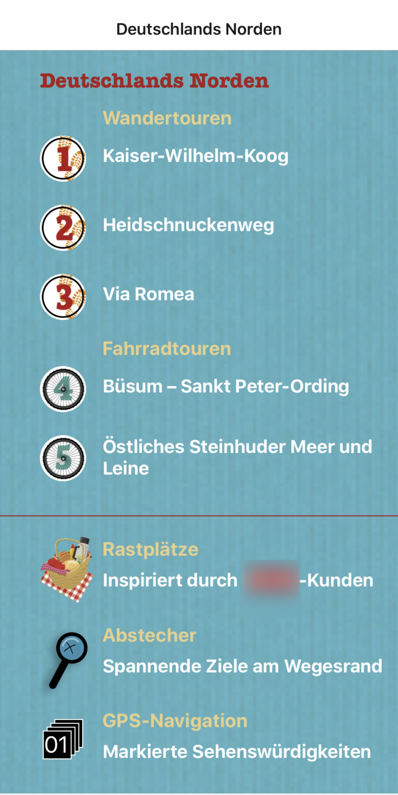
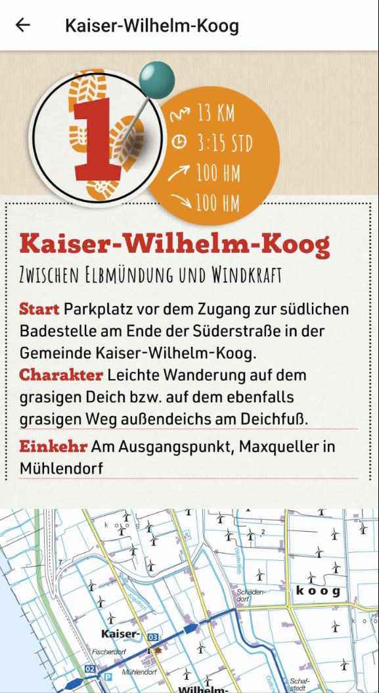

# City Guide App (Demo)

This repository showcases the UI and content structure of a mobile city guide application developed with React Native.  
The app was originally built as a client project and is presented here **without source code**, for portfolio and demonstration purposes only.

---

## Overview

The application is designed as a content-driven city guide, focusing on outdoor experiences across multiple regions in Germany.

It presents curated walking and cycling routes enriched with editorial content, along with supporting features such as rest and picnic areas, short detours, and GPS-based location information.

The main goal of the app is to provide an intuitive and visually rich way for users to explore outdoor routes and nearby points of interest.

## Screenshots

The screenshots below highlight the region overview and route detail screens of the application.

  
  

---

## Key Features

- Walking and cycling routes (Wander- & Fahrradtouren)
- Region-based navigation across Germany
- Route detail pages with summaries, maps, and editorial descriptions
- Rest and picnic areas (Rastplätze)
- Short detours and nearby points of interest (Abstecher)
- GPS-based navigation and marked highlights
- Content-focused, magazine-style UI

---

## Screenshots

> Screenshots shown below represent selected regions and routes within the app.

### Region Overviews
- North Germany overview
- West Germany overview

### Route Details
- Route summary: Kaiser-Wilhelm-Koog
- Route summary: Markkleeberger See
- Route detail content: Markkleeberger See

Screenshots are provided in the `/screenshots` folder.

---

## Technical Notes

- Built using **React Native**
- Focus on UI, layout structure, and content presentation
- This repository does **not** include source code due to client confidentiality
- Assets and screenshots are shared strictly for demonstration purposes

---

## Disclaimer

This project is shared as a **demo/showcase** only.  
All brand names, texts, and visual materials belong to their respective owners and are used here solely to demonstrate the application's UI and structure.

---

## Author

Developed as part of a professional client project.  
Shared here as a curated portfolio example.
